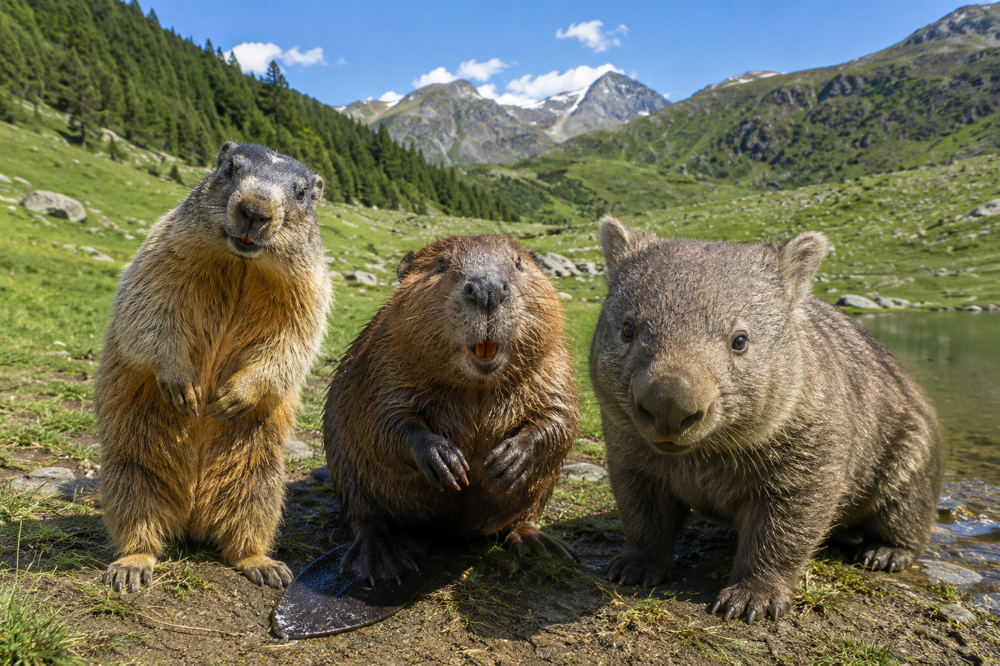
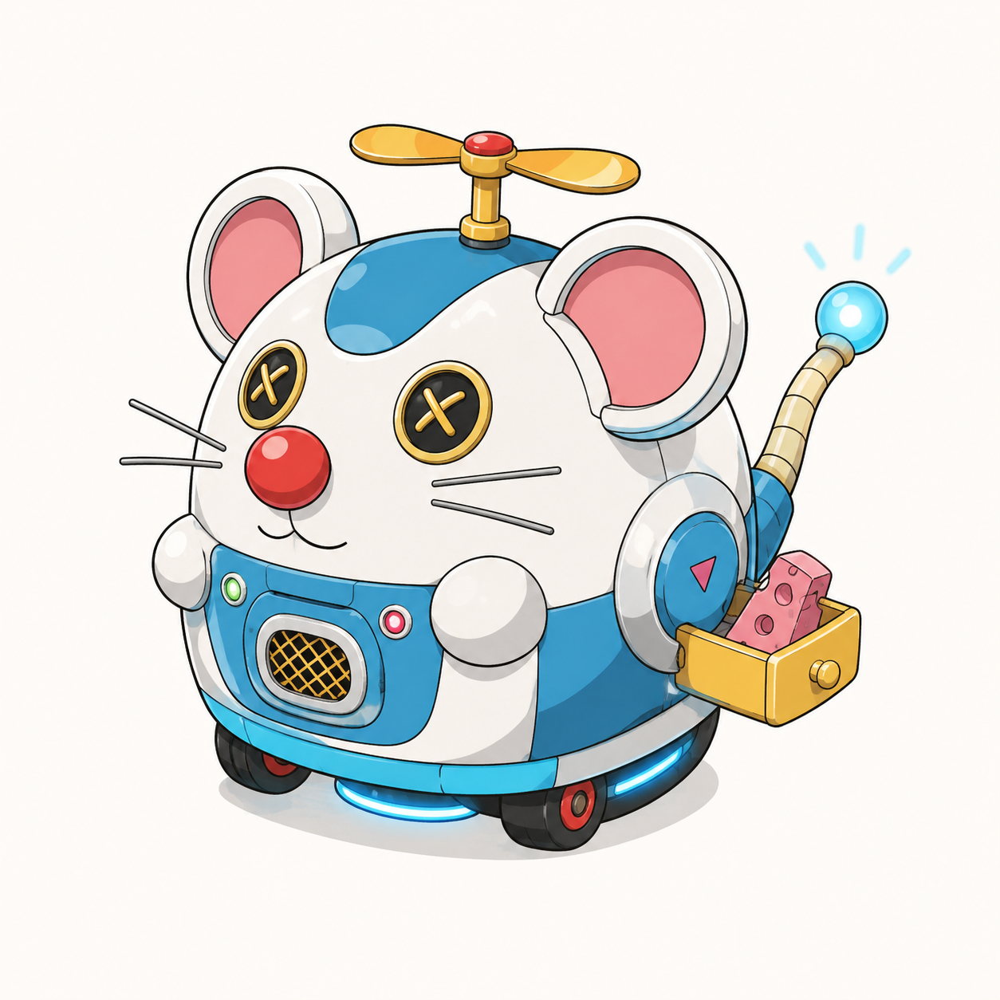
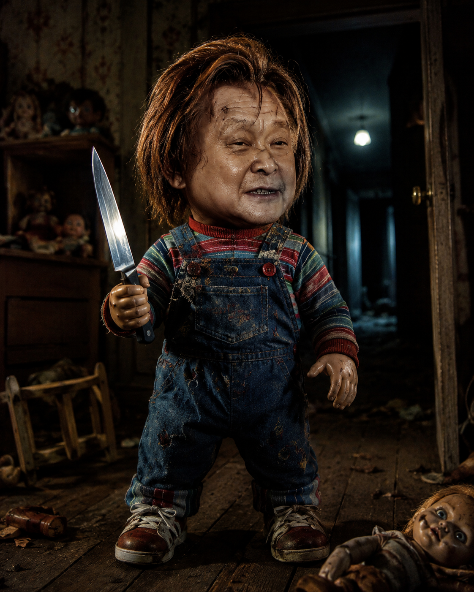
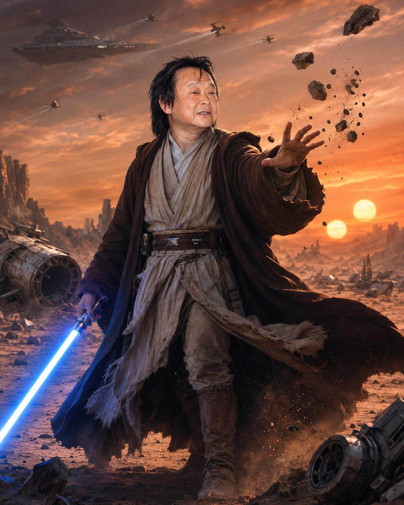
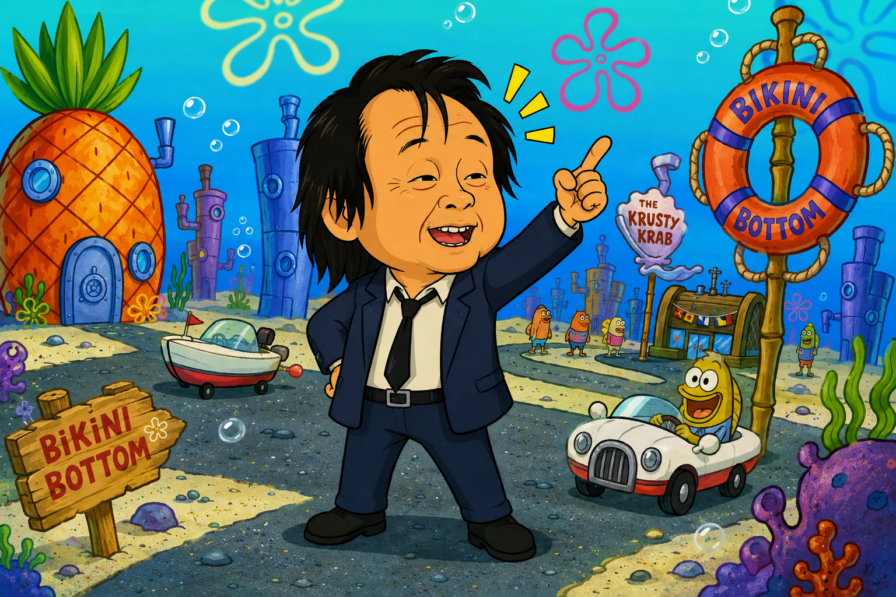
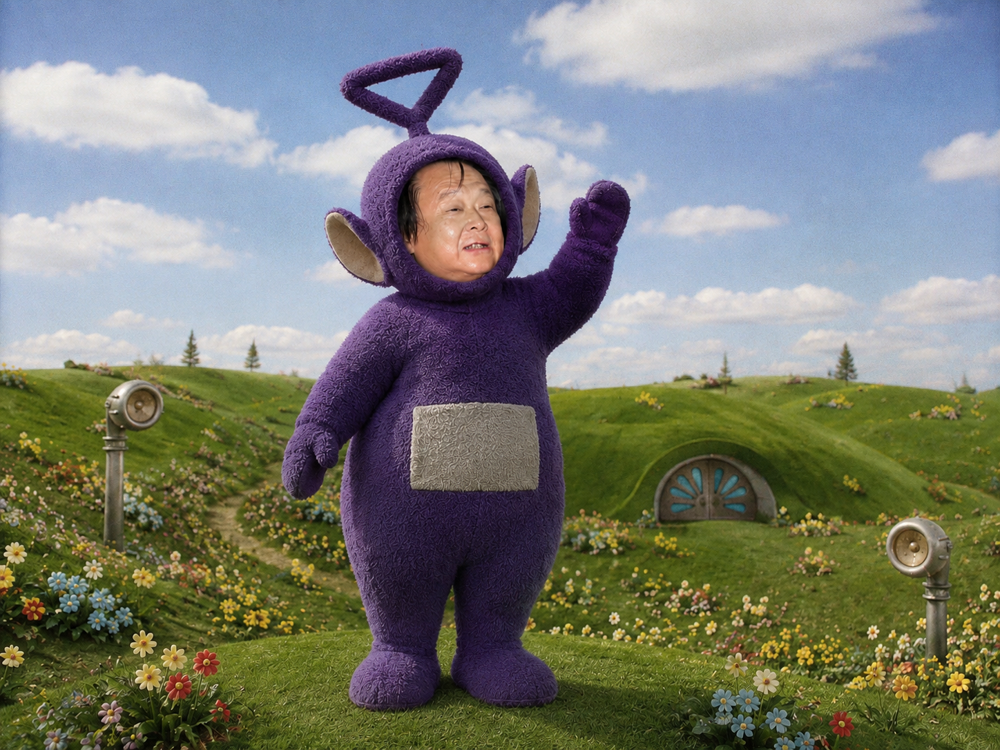
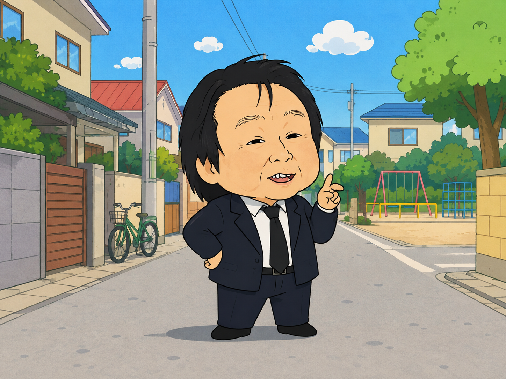

# AI 圖片生成

## text to image


```
產生一張寫實的土撥鼠 河狸 袋熊在同一個地區的有趣圖片
```


```
產生一張多啦A夢裡面會出現的機器鼠道具圖片
```

## image to image

### meta prompt

這裡因為沒特別指定, 所以 AI 只給我純文字, 大多時候會給你純文字或 markdown, 如果有指定輸出格式他便會明確給你

```text
給我能夠讓人物轉變為 鬼娃恰吉 星際大戰 海綿寶寶 天線寶寶 蠟筆小新 這些經典 IP 的提示詞, 細節跟場景都要描述清楚
```

### 恰吉



```text
以我上傳的人物照片作為唯一人物參考。

完整保留原人物的臉部辨識度、五官比例、眼睛形狀、鼻子、嘴型、臉型、髮型、髮色、性別、年齡感與主要個人特徵。
不要把人物替換成其他人的臉，不要隨機改變五官。
將原人物自然轉變成《鬼娃恰吉》世界中的恐怖玩偶角色，讓人一眼就能看出是這個人，但同時又具有經典鬼娃恰吉的強烈風格。

人物的整體造型要像詭異的殺人玩偶。
頭部比例略大，四肢較短，身體是玩偶般的尺寸與比例，但臉部仍保留照片中本人的辨識特徵。
皮膚帶有塑膠玩偶與人類皮膚混合的質感，表面略微粗糙、有舊化痕跡、細小裂紋與磨損，營造 오래使用的邪門玩偶感。
表情帶有瘋狂、邪氣、得意又詭異的笑容，眼神兇狠、帶有威脅感。

髮型保留原人物原本髮型輪廓，但重新設計成恰吉風格的玩偶頭髮質感，髮絲蓬鬆、凌亂、帶有復古玩具感。
如果適合，可讓頭髮呈現偏橘紅或髒金色調，但仍需保留原人物髮型辨識特徵。

服裝採用經典恰吉風格：
彩色條紋長袖上衣，
外面穿藍色牛仔吊帶褲，
吊帶褲上有明顯縫線、口袋與玩偶服裝感，
衣服有些微磨損、髒污、折痕與舊化感。
鞋子是復古兒童球鞋或玩偶鞋。

人物右手拿著一把反光明顯的廚房刀，
刀面帶有冷冽金屬光澤，
刀刃乾淨鋒利，具有強烈危險感。
左手自然垂下或微微抬起，呈現準備攻擊的姿態。

場景位於陰暗恐怖的室內空間，
像是老舊房屋走廊、破舊兒童房、地下室或廢棄玩具店。
背景中可以看到：
昏暗閃爍的燈光、
老舊木地板、
泛黃壁紙、
散落的玩具、
翻倒的小椅子、
破舊洋娃娃、
牆角陰影、
微微敞開的門、
遠處模糊的走廊。

光線設計採用經典恐怖片風格。
主光源來自上方微弱鎢絲燈泡或走廊盡頭的冷色燈光。
人物臉部有強烈明暗對比。
刀子反射冷白色高光。
整體色調偏暗，帶有紅棕色、髒黃色、墨綠色與冷藍色陰影。
氣氛壓迫、陰森、危險。

構圖採用電影級恐怖片海報風格。
人物位於畫面中央或稍微偏前景，
鏡頭略低角度拍攝，讓玩偶角色看起來更有壓迫感。
景深略淺，人物臉部與刀具最清楚，背景帶有適度模糊。

整體風格必須是高細節、寫實、電影級恐怖片質感。
看起來像經典 80～90 年代恐怖電影正式宣傳劇照。
不要做成可愛玩具。
不要做成普通卡通。
不要變成廉價 cosplay。
不要把人物的臉改得認不出來。
不要弱化驚悚感。

最終效果應該像：
「這個上傳的人物，真的變成了鬼娃恰吉宇宙中的主角級恐怖玩偶。」
```

### 星戰



```text
將照片中的人物轉變成《Star Wars 星際大戰》宇宙中的 Jedi 絕地武士。

完整保留原人物的真人臉孔、五官比例、髮型、性別、年齡感與人物辨識度。
不要變成任何現有演員。
人物就是自己在星際大戰宇宙中的版本。

人物穿著完整的 Jedi 絕地武士服裝。

服裝包含：
米白色交疊式 Jedi tunic 內袍、
深棕色皮革腰帶、
多層次布料、
棕色長靴、
厚重深棕色 Jedi 長斗篷。

布料必須有真實粗織纖維、磨損、灰塵與旅行留下的使用痕跡。
不要看起來像廉價 cosplay。

人物右手握著一把真正啟動中的藍色光劍。

光劍握柄使用高度細緻的銀黑金屬機械結構。
藍色光劍具有極度明亮的白色核心。
外圍散發濃烈藍色能量光暈。
藍色光線自然照射到人物臉部、手掌、衣服與附近環境。

人物表情沉著、冷靜、專注。

左手向前伸出，
正在使用 Force 原力。

前方數塊大型岩石、金屬碎片與沙粒懸浮在空中。

場景位於一顆荒涼的外星沙漠星球。

地面布滿：
巨大岩石、
沙丘、
乾裂土地、
廢棄機械、
墜毀太空船殘骸。

遠方有巨型山脈。

天空中同時存在兩顆太陽。
巨大的橘紅色夕陽照亮整個沙漠。

天空上方可以看到數艘小型戰鬥機正在高速飛過。
遠處天空有一艘龐大的 Star Destroyer 級大型宇宙戰艦緩慢穿過雲層。

空氣中充滿細小沙塵。
斗篷受到強風吹動。

電影級攝影。
史詩級廣角構圖。
35mm anamorphic lens。
cinematic lighting。
volumetric lighting。
dramatic atmosphere。
extremely detailed。
photorealistic。

使用橘色夕陽與藍色光劍形成強烈冷暖對比。

人物位於畫面中央。
鏡頭略低於人物視線。
讓人物呈現英雄式巨大比例。

整體效果應該像真正的 Star Wars 電影劇照，而不是粉絲 cosplay 照。
```

### 海綿寶寶



```text
將照片中的人物轉變成《海綿寶寶》世界觀中的卡通角色。

保留原人物最重要的臉部辨識特徵，包括臉型、眼睛形狀、眉毛、鼻子、嘴巴、髮型與整體神情，但將所有特徵重新設計成誇張、幽默、可愛的美式海底卡通造型。

人物的身體具有海綿寶寶世界特有的簡單幾何造型、粗黑輪廓線、鮮艷平塗色彩、誇張四肢與卡通比例。服裝可以保留原照片服裝的主要元素，但是重新畫成比奇堡居民會穿的卡通版本。

場景位於 Bikini Bottom 比奇堡熱鬧的海底街道。

背景可以清楚看到：
海底沙地、
巨大彩色珊瑚、
海草、
岩石、
漂浮氣泡、
花朵形狀的海底天空圖案、
遠處具有海綿寶寶風格的奇怪住宅建築。

畫面附近出現鳳梨屋風格的海底住宅、復古船錨造型路牌以及奇怪的海底交通工具。

整體氣氛非常歡樂、荒謬、幽默。

使用明亮的黃色、藍色、粉紅色、橘色與綠色。
線條粗獷且略微不規則。
使用傳統 2D 美國電視卡通質感。
避免 3D Pixar 質感。
避免寫實皮膚。
避免真人身體搭配卡通背景。

人物站在畫面中央，略微廣角鏡頭，充滿活力的動態姿勢，臉部表情誇張而開心。

整張圖片看起來就像《海綿寶寶》動畫中的一個正式畫面截圖。
```

### 天線寶寶



```text
將照片中的人物轉變成《天線寶寶》世界中的角色。

完整保留原人物的臉部辨識度、眼睛、鼻子、嘴型、臉型與表情。
人物的真人臉自然嵌入天線寶寶角色圓形的臉部開口中，看起來像真正存在的天線寶寶角色，而不是簡單把臉貼上去。

人物擁有圓滾滾、柔軟、厚實的天線寶寶身體。
全身覆蓋細緻柔軟的短毛絨材質。
身體比例笨重、可愛、圓潤。
腹部有大型銀灰色電視螢幕。
頭頂有一根巨大而具有辨識度的幾何形狀天線，可以依人物個性設計成：
圓形、
三角形、
螺旋形、
環形
其中之一。

服裝主色使用非常鮮艷的紫色、綠色、黃色或紅色。

場景位於經典天線寶寶草原世界。

背景是一大片起伏柔和、幾乎沒有樹木的鮮綠色丘陵。
天空呈現夢幻的淺藍色。
有大片柔軟白雲。
草地上散落大量色彩鮮豔的小花。

遠處可以看到經典的圓形地下住宅入口與巨大半圓形金屬門。
草地上偶爾出現奇怪的巨大喇叭裝置。

陽光非常柔和。
空氣帶有輕微夢境般的薄霧。
整個世界乾淨、童趣、荒謬又帶有一點超現實感。

人物站在草丘最高的位置，面對鏡頭揮手。
使用稍微低角度廣角鏡頭。
可以看到完整身體與巨大草原。

畫面的影像質感接近 1990 年代兒童電視節目實景攝影。
柔和自然光。
略帶復古電視畫面質感。
真實毛絨材質。
不要變成普通卡通。
不要 Pixar 化。
不要塑膠玩具感。

最終效果應該像照片中的人物真的成為第五位天線寶寶。
```

### 蠟筆小新




```
以我上傳的人物照片作為唯一人物參考。

完整保留原人物的臉部辨識度、五官比例、眼睛位置、鼻子、嘴型、臉型、髮型、髮色、性別、年齡感與主要個人特徵。
不要把人物替換成其他人的臉，不要隨機改變五官。
將原人物自然轉換成《蠟筆小新》動畫世界中的角色，讓人一眼就能看出是這個人，但整體風格必須明顯屬於蠟筆小新那種經典日系搞笑動畫風格。

人物整體變成蠟筆小新風格的 Q 版造型：
頭部比例較大，
身體短短胖胖、圓潤可愛，
四肢簡化，
五官線條簡潔，
表情生動又帶有搞笑感。

臉部設計保留原人物辨識度，
但使用蠟筆小新風格重新詮釋：
眼睛可簡化成小而明確的黑點或簡化卡通眼型，
眉毛可以稍微加粗，
鼻子與嘴巴使用非常簡單的卡通線條，
整體輪廓圓潤可愛，
表情帶有呆萌、調皮、無厘頭或搞笑感。

髮型保留原人物原本輪廓與特徵，
但改成蠟筆小新動畫中的簡化平塗造型，
線條俐落、形狀清楚，
不做寫實髮絲。

服裝保留原照片服裝的主要特色，
但重新簡化成蠟筆小新風格的卡通服裝。
如果希望更有作品感，也可以替人物穿上日常休閒服，
例如簡單上衣、短褲、襪子、球鞋，
色彩鮮明、造型樸素、很有日常動畫感。

場景位於典型的《蠟筆小新》世界日常場景中，
例如日本郊區住宅街道、幼稚園教室、公園、家中客廳或春日部風格的街景。

背景可以清楚看到：
低樓層住宅、
簡單圍牆、
電線桿、
綠色樹木、
藍天白雲、
小公園遊具、
腳踏車、
住宅門口、
街道轉角、
溫馨又普通的日常生活感。

如果使用室內場景，
則可出現：
日式家庭客廳、
電視、
矮桌、
靠墊、
玩具、
蠟筆小新世界常見的溫馨家庭氛圍。

整體畫面風格必須是經典 2D 日式動畫風格，
使用乾淨平塗色塊，
線條簡單俐落，
色彩明亮溫暖，
帶有濃厚的童趣、搞笑與日常感。

不要做成寫實風。
不要做成 3D。
不要做成複雜華麗插畫。
不要做成其他日漫風格。
不要做成 Pixar 風。
不要保留真實皮膚質感。
不要過度精細渲染。
重點是還原《蠟筆小新》那種簡單、可愛、幽默、生活化的動畫感。

人物位於畫面中央，
使用輕鬆自然的站姿或帶有搞笑動作的姿勢，
例如叉腰、揮手、歪頭、傻笑、裝可愛、做出無厘頭動作。
鏡頭角度平視，
構圖像動畫截圖或正式角色插圖。

整張圖要像是：
「這個上傳的人物真的進入了《蠟筆小新》的動畫世界，成為其中一名自然又有趣的角色。」

避免：
臉部走樣、
人物辨識度消失、
過度寫實、
廉價變形、
手指錯誤、
多餘肢體、
奇怪表情、
文字、
watermark、
logo。
```