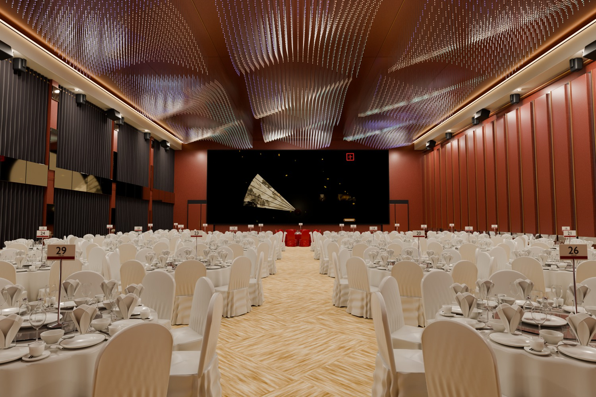

## 廢言

因為 meeting 被問到 blender 能幹嘛? 其實不能幹嘛, 就是炫炮 ~

不過還是 vibe coding 弄一個有意義的

`Astra Max`

執行建模大概 50 分鐘, 適合吃飯前下命令, 等模型建立好圖也 render 好, 然後用手機叫他建立網頁即可

請大家 [先開啟](https://nkust-moon-festival.weber87na.chatgpt.site) 看看 blender 然後記得要來參加迎新送舊



模型建立提示詞如下
```text
你收集高雄林皇宮世紀廳的照片 使用 blender 建置他的 3d 模型 中間舞台的螢幕使用這網站的扇子照片
```

網頁建立提示詞如下
```text
你使用精修出來的模型做成 three.js 的網頁, 隨機把這些人名 show 在椅子上, 藍色幻感的文字,同類的會座一起 有師長, 113 114 115 博士
```

## 正題
這裡示範如何使用 Blender 進行建模. 依我自己的測試, 建議不要使用 computer use, 因為它似乎會直接使用 Python, 然後撰寫大量程式碼來建模.
這次使用 `Astra 輕度`, 效果如下, 整體馬馬虎虎, 不過已經解決以前苦於沒有模型, 還得前往 https://sketchfab.com 下載免費模型的窘境.

這裡也有我建置的玫瑰花模型, 可以[參考](https://www.youtube.com/watch?v=il8LkXQMiCQ).


```markdown
使用 Blender 根據 [中秋.png](中秋.png) 繪製月餅的寫實 3D 模型, 並包含真實紋理.
```

這裡 Codex 做錯了一個步驟, 以下是修正用的提示詞.

```
我匯出 glTF 後, 在 [glTF Viewer](https://gltf-viewer.donmccurdy.com/) 中查看, 發現模型沒有顏色.
```

所以, 完成後如果要做其他應用, 記得匯出模型, 再到 https://gltf-viewer.donmccurdy.com/ 檢查一下.

有興趣的話, 也可以到 https://ar-js-org.github.io/studio/pages/marker/index.html 上傳模型, 就能將它製作成簡單的 AR 網頁應用.

不過還要處理 HTTPS 的問題, 目前有點麻煩, 礙於時間, 之後有空再示範.
