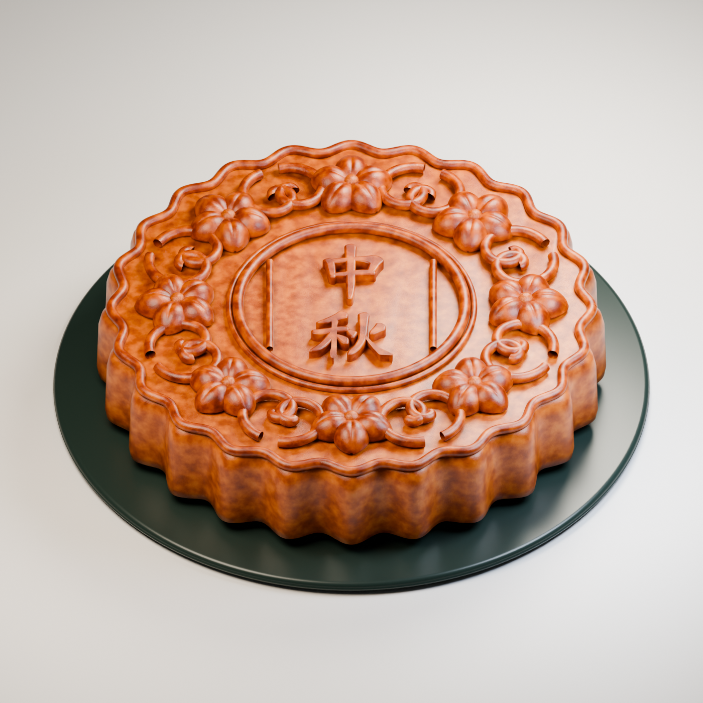

這裡示範如何使用 Blender 進行建模. 依我自己的測試, 建議不要使用 computer use, 因為它似乎會直接使用 Python, 然後撰寫大量程式碼來建模.
這次使用 `Astra 輕度`, 效果如下, 整體馬馬虎虎, 不過已經解決以前苦於沒有模型, 還得前往 https://sketchfab.com 下載免費模型的窘境.

這裡也有我建置的玫瑰花模型, 可以[參考](https://www.youtube.com/watch?v=il8LkXQMiCQ).




```markdown
使用 Blender 根據 [中秋.png](中秋.png) 繪製月餅的寫實 3D 模型, 並包含真實紋理.
```

這裡 Codex 做錯了一個步驟, 以下是修正用的提示詞.

```
我匯出 glTF 後, 在 [glTF Viewer](https://gltf-viewer.donmccurdy.com/) 中查看, 發現模型沒有顏色.
```

所以, 完成後如果要做其他應用, 記得匯出模型, 再到 https://gltf-viewer.donmccurdy.com/ 檢查一下.

有興趣的話, 也可以到 https://ar-js-org.github.io/studio/pages/marker/index.html 上傳模型, 就能將它製作成簡單的 AR 網頁應用.

不過還要處理 HTTPS 的問題, 目前有點麻煩, 礙於時間, 之後有空再示範.
