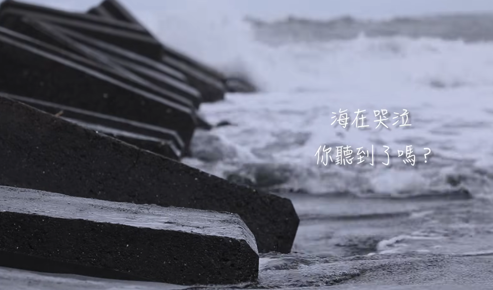

這裡如果使用 ffmpeg 權限問題的話請使用 `sol` 問, 一般他會需要你開放沙盒權限, 以我為例, 這樣可以開啟沙盒權限

如果直接下載官方版本開放全局則不會遇到此問題, 這問題只會發生在使用 winget 進行安裝

這段請直接丟給 AI 他只會在一次對話內生效
```text
/sandbox-add-read-dir C:\Users\yourname\AppData\Local\Microsoft\WinGet\Packages\Gyan.FFmpeg.Essentials_Microsoft.Winget.Source_8wekyb3d8bbwe
```

## 聽海

[聽海](https://www.youtube.com/watch?v=bVEWjiqkoHQ)

這裡我們來介紹怎麼用 ffmpeg 切 mv 擷取副歌, 增加憂鬱的氛圍, 首先 yt-dlp 下載 mv

```powershell
yt-dlp https://www.youtube.com/watch?v=bVEWjiqkoHQ
```

重命名
```
mv "朱立倫Ｘ顏寬恒 消坡塊上深情對唱「聽海 」│ 聽海 cover│張惠妹│ [bVEWjiqkoHQ].webm" 聽海.webm
```

接著使用 ffmpeg 擷取精華片段, 這裡打不出來指令所以下 prompt

```markdown
使用 ffmpeg 幫我擷取 [聽海.webm](D:/聽海/聽海.webm) 1:50 ~ 2:22 開頭漸進, 結尾漸弱, 並且在影片加上憂鬱的藍色色調
```

[成品請參考這裡](https://youtu.be/QVTZnvcV_Jw)

## 鐵達尼

[鐵達尼](https://www.youtube.com/watch?v=nJkhLNadub8)

接著示範鐵達尼號音樂下載
```powershell
yt-dlp https://www.youtube.com/watch?v=nJkhLNadub8
mv '是人聽了都會流淚的「鐵達尼號」悠揚笛聲版 [nJkhLNadub8].mkv' '鐵達尼.mkv'
```

接著執行 prompt
```markdown
[鐵達尼.mkv](鐵達尼.mkv) 擷取這段 3:10 秒到結尾, 並且改為增加復古雜訊, 呈現一種老式黑白電影風格, 聲音開頭漸進式
```

[成品請參考這裡](https://youtu.be/06OWHC3sQnU)