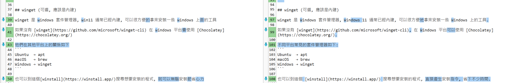

這個部分比較簡單, 當有文件做好時以往都需要人工校正錯字, 或是文意是否通順

以我個人為例, 因為平時撰寫 markdown 比較懶得切換中文標點符號, 所以我的標點符號都是半形為主

以下是這份教材我請 AI 幫我尋找錯字然後修改的 prompt

````markdown
## 第一輪
[環境建置.md](環境建置.md) 參考這份計計劃替我修改這些錯字用詞

## 第二輪
我的標點符號請使用半形, 不要用全形

## 第三輪
我要講解 AI 課程, 請依照重要程度調整段落順序, 必裝的排最上方 [環境建置.md](環境建置.md)
````

可以看到這份 [規劃](錯字用詞修正/計畫.md), 我撰寫時還是很多用詞 AI 覺得不佳



同樣原理應該也是可以套在 word 上

這裡可以找到線上比對文字差異的軟體看看

所以如果指導教授對用詞有特別要求的話, 可能是可以收集他歷年來指導的論文進行分析出一套用詞, 最後請 AI 修改成該種撰寫風格